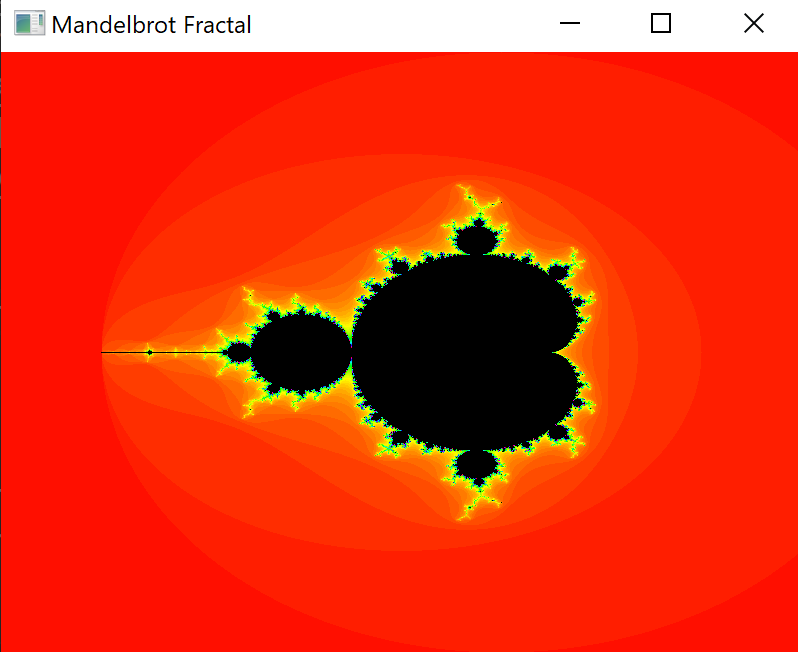
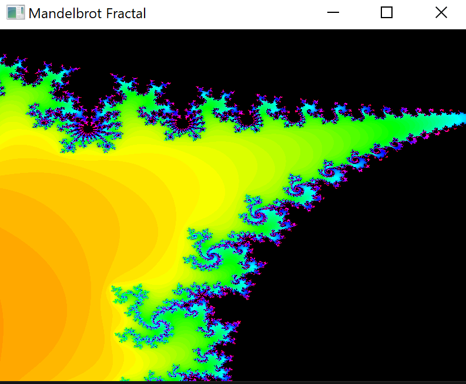

# cpp-middle-project-sprint-9 <!-- omit in toc -->

## Description

This project is a Mandelbrot fractal renderer that uses C++23 coroutines and executors to render the fractal in parallel. stdexec is used for parallel execution. Based on diffetent schedulers - CPU thread pool, GPU thread pool.





- [Environment Variable Setup](#environment-variable-setup)
- [Getting Started](#getting-started)
- [Building the Project and Running Tests](#building-the-project-and-running-tests)
  - [Project Building Commands](#project-building-commands)
  - [Application Running Commands](#application-running-commands)
  - [Test Running Command](#test-running-command)
  - [Command to run clang-format — mandatory requirement before code review](#command-to-run-clang-format--mandatory-requirement-before-code-review)
  - [Debugger Launch Commands](#debugger-launch-commands)
- [Additionally](#additionally)


Repository template for the practical assignment of the 9th sprint "C++ Middle Developer".

## Environment Variable Setup

For the container to work correctly, add two environment variables `USER_UID` and `USER_GID` to your bash profile with the command `echo -e '\nexport USER_UID=$(id -u)\nexport USER_GID=$(id -g)' >> ~/.bashrc`.

Then update the bash profile settings with the command `source ~/.bashrc`.

## Getting Started

1. Click the green "Use this template" button and then "Create a new repository".
2. Name your repository.
3. Clone the created repository with the command `git clone your-repository-name`.
4. Create a new branch with the command `git switch -c development`.
5. Open the project in Visual Studio Code.
6. Press F1 and open the project in the dev container with the command `Dev Containers: Reopen in Container`.

## Building the Project and Running Tests

The repository uses three tools:

- Conan — a free, open-source C and C++ package manager (MIT). It allows setting up the build process, downloading and installing third-party dependencies, and necessary tools. Read more about Conan:
  - https://habr.com/ru/articles/884464
  - https://docs.conan.io/2.0/tutorial/consuming_packages/build_simple_cmake_project.html
  - https://docs.conan.io/2.0/tutorial/consuming_packages/the_flexibility_of_conanfile_py.html

- CPM.cmake — CMake dependency manager. Since not all packages are available in `Conan`, CPM.cmake is a convenient alternative: https://github.com/cpm-cmake/CPM.cmake.

- cmake — build system generator for C and C++. It allows creating projects that can be compiled on different platforms with different compilers. Read more about cmake:
  - https://dzen.ru/a/ZzZGUm-4o0u-IQlb
  - https://neerc.ifmo.ru/wiki/index.php?title=CMake_Tutorial
  - https://cmake.org/cmake/help/book/mastering-cmake/cmake/Help/guide/tutorial/index.html

- VS Code Dev Docker container — Docker container that contains a fully configured environment for the assignment. Read more about Docker:
  - [Everything you might want to know about Docker (in Russian)](https://habr.com/ru/articles/822707/)
  - [Official VS Code Documentation](https://code.visualstudio.com/docs/devcontainers/containers)
  - [Docker container for VS Code](https://www.youtube.com/watch?v=p9L7YFqHGk4)
  - [Docker in 1 hour](https://www.youtube.com/watch?v=pg19Z8LL06w&t=174s&pp=ygUPRG9ja2VyY29udGFpbmVy)

### Project Building Commands

The F5 key will help:
- Create the build folder.
- Invoke conan commands to install libraries and start the build process.
- Launch the lldb debugger.

Note: when building the project without changes, you will get a large error containing ` note: the expression ‘enable_sender<typename stdexec:: ... [with _Sender = SfmlEventHandler]’ evaluated to ‘false’`. Recall why such an error may appear when working with `stdexec` and how we solved a similar problem in the course.

### Application Running Commands

```bash
cd build
./MandelbrotFractal
```

### Test Running Command

```bash
cd build
./MandelbrotFractal_tests
```

### Command to run clang-format — mandatory requirement before code review

Automatic clang-format launch is configured in this repository (.vscode/settings.json configuration file) whenever a code file is saved.

Ensure this functionality is working:
- Add several empty lines to any file.
- Save the file.
- If the empty lines are removed, it's working; if not, ensure clangd is operating (when opening a code file, the blue bar at the bottom of VS Code should say clangd: idle). To do this:
    - press `F1` and execute the command `clangd: Download language server`;
    - press `F1` and execute the command `clangd: Restart language server`;
    - press `F1` and execute the command `Developer: Reload Window`.

### Debugger Launch Commands

In Visual Studio Code, debugger launch parameters are located in the .vscode/launch.json file. Since this file already contains a Launch GeometryApp configuration to run an application that calculates file checksums, to start the debugger, just press F5 or open the Run and Debug window using `Ctrl+Shift+D`.

## Additionally

To set up Ctrl + Space autocomplete, press `F1` and execute the command `clangd: Download language server`. VS Code will suggest installing the appropriate clangd version (pop-up in the bottom right corner). After installation, reload the window via the restart button at the bottom right or with `F1` and the `Developer: Reload Window` command.

If done correctly, you'll be able to use autocomplete after successfully building the project.
